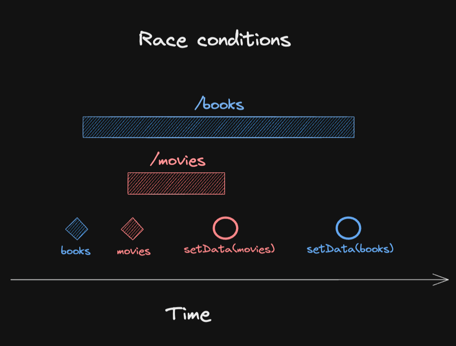

## I have been working with frontend frameworks for some good amount of time.

<p> I started working on React back in 2016, At that time React was bundled with redux. Everyone used redux.

While working with Redux, I realised it was primarily not made for async state handling. It worked well for state which doesnt include datafetching or any async behavior of any sorts.

Redux fixed async data fetching with the concept of middlewares, Thunk, Sagas are some names which were popular.

But there were obvious pain pain points with Redux. YOU HAVE TO WRITE A LOT OF CODE.

</p>

### As the ecosystem moved forward, developers started to move away from Redux with other lightweight simpler alternatives.

- Context API
- UseState
- Jotai
- Zustand (I personally liked it for its ease of use)

<div style="margin-top: 420px;"></div>


## Data fetching is hard, It envolves all the worst part of java script.

- Validation
- async behaviors
- error managment.

Getting data fetching right is difficult.

```tsx
import { useEffect, useState } from "react";

const endpoint = "https://jsonplaceholder.typicode.com";
function Catalogue({ category }: { category: string }) {
  const [data, setData] = useState([]);
  const [error, setError] = useState();

  useEffect(() => {
    fetch(`${endpoint}/${category}`)
      .then((res) => res.json())
      .then((d) => setData(d))
      .catch((e) => setError(e));
  }, [category]);

  // Return JSX based on data and error state
}
```

## After we look at this code, do we spot some problems?

<div style="margin-top: 320px;"></div>



## Race conditions 🚙 🚙 🚙

<p>
Here we can see there could be situation where we have a category books initially, But it gets changed to movies before we get the results for books.
Who so ever comes last will be available in data.

In the end we might have inconsistent state.

```tsx
import { useEffect, useState } from "react";

const endpoint = "https://jsonplaceholder.typicode.com";
function Catalogue({ category }: { category: string }) {
  const [data, setData] = useState([]);
  const [error, setError] = useState();

  useEffect(() => {
    fetch(`${endpoint}/${category}`)
      .then((res) => res.json())
      .then((d) => setData(d))
      .catch((e) => setError(e));
  }, [category]);

  // Return JSX based on data and error state
}
```

### Lets try to fix this

<p>
React documentation hints us to fix it by an mounted flag in the cleanup function.

What happens here?

- We introduce an `mounted` flag, make it false.
- We only update the state and error when `mounted` flag is false.
- The cleanup function takes care of mounted when the dependency array changes, i.e. when the category changes.

## Looks ok enough?

</p>

```tsx
function Catalogue({ category }) {
  const [data, setData] = useState([]);
  const [error, setError] = useState();

  useEffect(() => {
    let mounted = false;
    fetch(`${endpoint}/${category}`)
      .then((res) => res.json())
      .then((d) => {
        if (!mounted) {
          setData(d);
        }
      })
      .catch((e) => {
        if (!mounted) {
          setError(e);
        }
      });
    return () => {
      mounted = true;
    };
  }, [category]);

  // Return JSX based on data and error state
}
```

## Loading state
As we can see there is no mechanism right now we dont know when is the data still being fetched.

Lets try to fix that

```tsx
function Catalogue({ category }) {
  const [isLoading, setIsLoading] = useState(true); //
  const [data, setData] = useState([]);
  const [error, setError] = useState();

  useEffect(() => {
    let mounted = false;
    setIsLoading(true); //
    fetch(`${endpoint}/${category}`)
      .then((res) => res.json())
      .then((d) => {
        if (!mounted) {
          setData(d);
        }
      })
      .catch((e) => {
        if (!mounted) {
          setError(e);
        }
      })
      .finally(() => {
        if (!mounted) {
          setIsLoading(false); //
        }
      });
    return () => {
      mounted = true;
    };
  }, [category]);

  // Return JSX based on data and error state
}
```

### Empty state

Possibly a bit of nitpicking here, but having empty array as initial state might not be a good idea. Though it helps us not to check for undefined all the time.

Consider a scenario when the results for a specific category are not set yet, you might get an empty array from the server.


lets change it a bit.

```tsx
function Catalogue({ category }) {
  const [isLoading, setIsLoading] = useState(true);
  const [data, setData] = useState(); //
  const [error, setError] = useState();

  useEffect(() => {
    let mounted = false;
    setIsLoading(true);
    fetch(`${endpoint}/${category}`)
      .then((res) => res.json())
      .then((d) => {
        if (!mounted) {
          setData(d);
        }
      })
      .catch((e) => {
        if (!mounted) {
          setError(e);
        }
      })
      .finally(() => {
        if (!mounted) {
          setIsLoading(false);
        }
      });
    return () => {
      mounted = true;
    };
  }, [category]);

  // Return JSX based on data and error state
}
```

## We dont reset the data and error when Category changes

<p>
Lets consider a scnario when the category A's fetch call fails and we get an error, we set the error state. But now when category B comes in we still have the error from A

So the state would be like

```tsx
data: fromCategoryB,
error: fromCategoryA
```

Lets see if my `JSX` looks like below which is something we usually write.

```tsx
return (
  <div>
    { error ? (
      <div>Error: {error.message}</div>
    ) : (
      <ul>
        {data.map(item => (
          <li key={item.id}>{item.name}</div>
        ))}
      </ul>
    )}
  </div>
)
```

Here even though we have results for category B, we are still showing the error we got from category A.

There would be no results shown for B.

To fix this lets try to introduce the reset of `data` and `error`

```tsx
function Catalogue({ category }) {
  const [isLoading, setIsLoading] = useState(true);
  const [data, setData] = useState();
  const [error, setError] = useState();

  useEffect(() => {
    let mounted = false;
    setIsLoading(true);
    fetch(`${endpoint}/${category}`)
      .then((res) => res.json())
      .then((d) => {
        if (!mounted) {
          setData(d);
          setError(undefined); //
        }
      })
      .catch((e) => {
        if (!mounted) {
          setError(e);
          setData(undefined); //
        }
      })
      .finally(() => {
        if (!mounted) {
          setIsLoading(false);
        }
      });
    return () => {
      mounted = true;
    };
  }, [category]);

  // Return JSX based on data and error state
}
```

# How our harmless component exploded into this

```tsx
function Catalogue({ category }) {
  const [isLoading, setIsLoading] = useState(true);
  const [data, setData] = useState();
  const [error, setError] = useState();

  useEffect(() => {
    let mounted = false;
    setIsLoading(true);
    fetch(`${endpoint}/${category}`)
      .then((res) => res.json())
      .then((d) => {
        if (!mounted) {
          setData(d);
          setError(undefined); //
        }
      })
      .catch((e) => {
        if (!mounted) {
          setError(e);
          setData(undefined); //
        }
      })
      .finally(() => {
        if (!mounted) {
          setIsLoading(false);
        }
      });
    return () => {
      mounted = true;
    };
  }, [category]);

  // Return JSX based on data and error state
}
```

<div style="margin-top:130px"> </div>

# Lets try to replace it with React Query

```tsx
import { useQuery } from "@tanstack/react-query";
import React from "react";

const endpoint = "https://jsonplaceholder.typicode.com";

function Catalogue({ category }) {
  const { isLoading, data, error } = useQuery(
    ["Catalogue", category], // State is stored with category
    () =>
      fetch(`${endpoint}/${category}`).then((res) => {
        if (!res.ok) {
          throw new Error("Failed to fetch");
        }
        return res.json();
      })
  );

  if (isLoading) return <p>Loading...</p>;
  if (error) return <p>Error: {error.message}</p>;

  return (
    <div>
      {data && (
        <ul>
          {data.map((item) => (
            <li key={item.id}>{item.name}</li>
          ))}
        </ul>
      )}
    </div>
  );
}

export default Catalogue;
```

## How it solved the above possible bugs

## 🐛 Bugs

🔥 There is no race condition because state is always stored by its input (category).

React Query ensures that state is always stored by its input (category). Each query is uniquely identified by the queryKey, so state updates are scoped to the specific category.

🔥 You get loading, data and error states for free, including discriminated unions on type level.

🔥 Empty states are clearly separated and can further be enhanced with features like placeholderData.

You can use `placeholderData` if you want to initialise your empty state, situations hwere you want to maintain a certain structure of your UI.


🔥 You will not get data or error from a previous category unless you opt into it.

As every fetching is category based, we dont find ourselves in a situation where we get erros from one and data from another.

🔥 Multiple fetches are efficiently deduplicated, including those fired by StrictMode.
As its a cache first mechanism we can get away with strict mode issues in react.